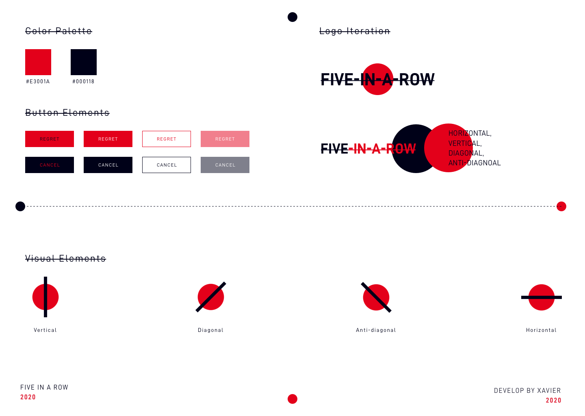
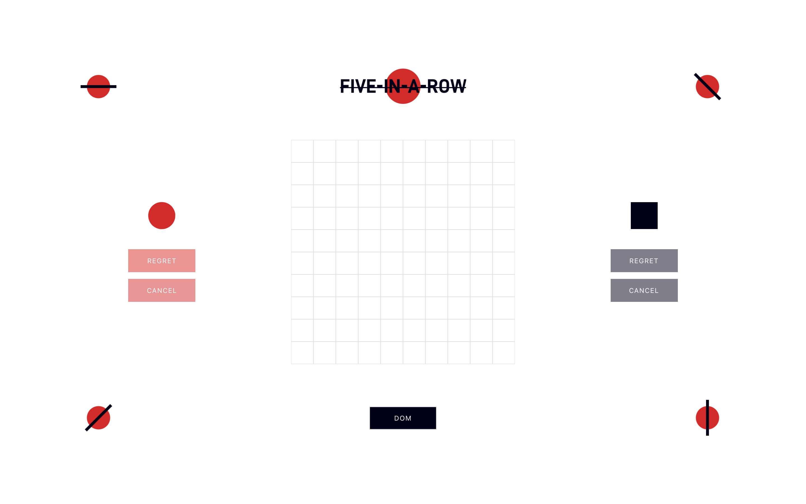
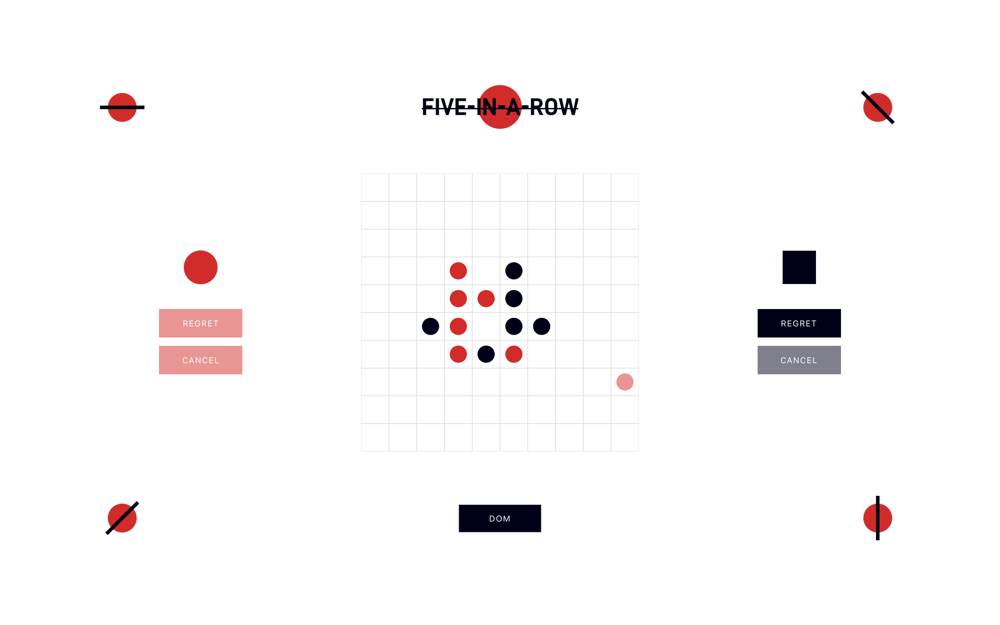
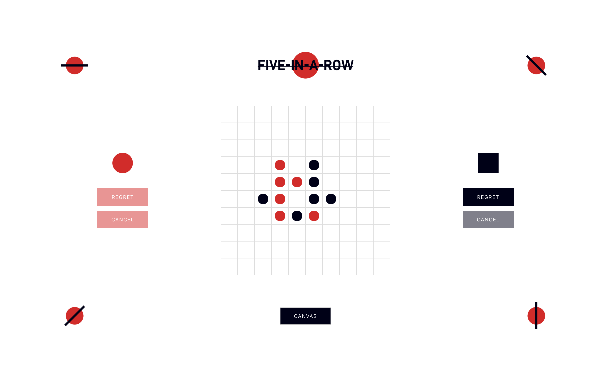
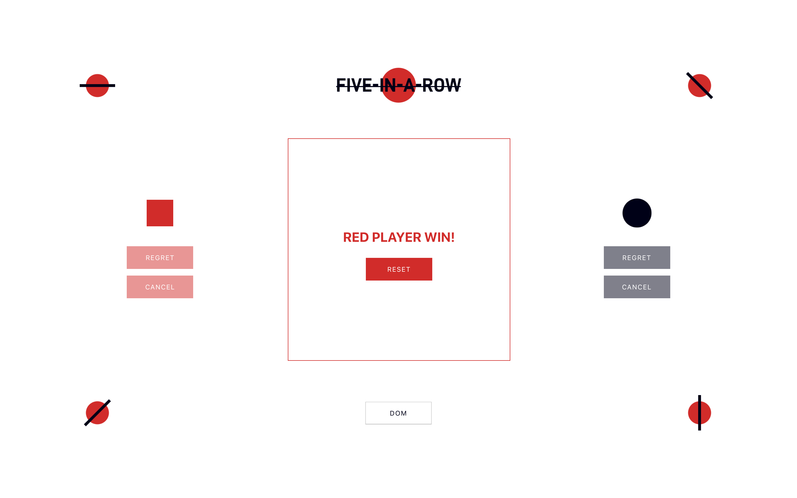

### FIVE-IN-A-ROW
live demo. [click here](https://xiaoajin.github.io/index.html)

## 设计(Design)

## 预览(Preview)
+ 初始页

+ 下棋

+ 切换Canvas/Svg(dom)

+ 胜利

## 说明(Description)
项目使用React开发，做了简单的适配（非常基础）。
+ 检查是否胜利的思路是同时左右查找。
+ 悔棋和撤销的思路是保存上一步的位置信息。
## 缺陷(TODO)
+ 有许多冗余的方法
+ 声明过多用于状态控制的变量
+ 模块结构没有拆解，大部分代码都集中在一个文件中
+ 目前没有测试配置项
